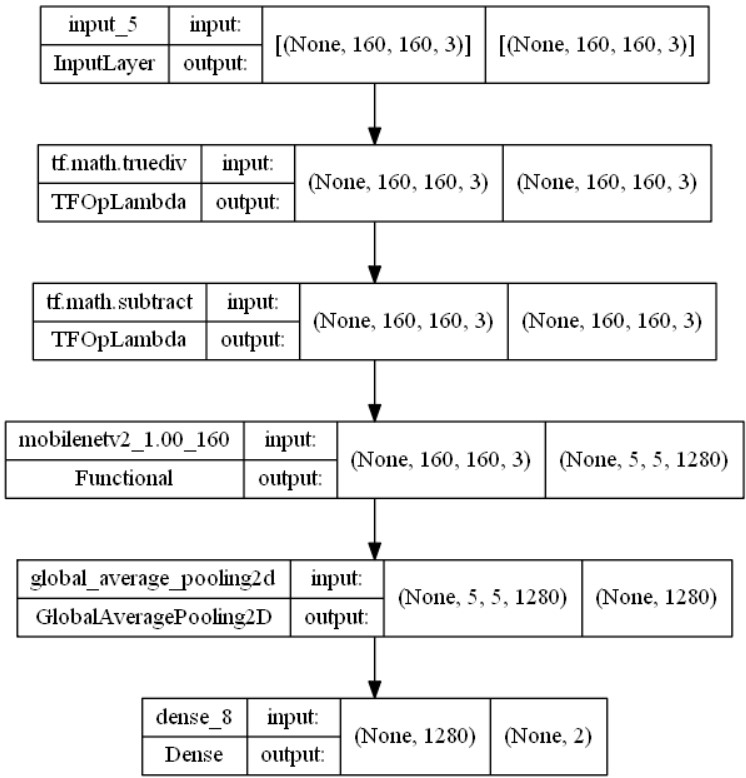
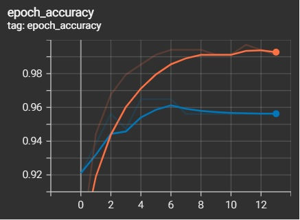
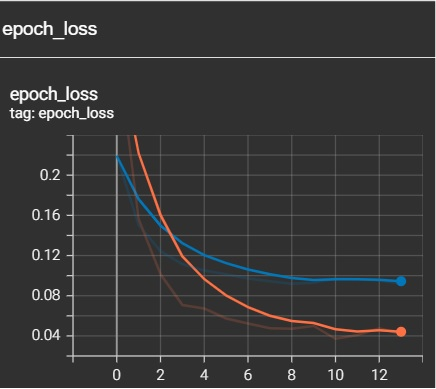
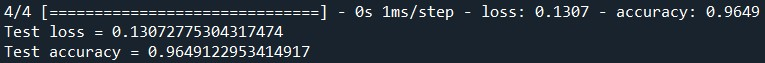

# Breast Cancer Classification
## 1. Objective
To create a Feedforward Neural Network model with high accuracy (> 80%) that predict breast cancer, whether the tumour is <br />
&nbsp;&nbsp; i) malignant, or <br />
&nbsp;&nbsp; ii) benign <br />

## 2. Dataset
The model is trained with [Breast Cancer Wisconsin (Diagnostic) Dataset](https://www.kaggle.com/datasets/uciml/breast-cancer-wisconsin-data)

## 3. IDE and Framework
&nbsp;&nbsp; i) IDE: Sypder 
&nbsp;&nbsp; ii) Frameworks: Pandas, Scikit-learn and TensorFlow Keras.

## 4. Methodology
### 4.1. Data Pipeline
The data is first loaded and preprocessed, such that unwanted features are removed, and label is encoded in one-hot format. Then the data is split into train-validation-test sets, with a ratio of 60:20:20.

### 4.2. Model Pipeline
A feedforward neural network is constructed that is catered for classification problem. 
The structure of the model is shown as Figure below.



The model is trained with a batch size of 32 and for 100 epochs. Early stopping is applied in this training. The training stops at epoch 24, with a training accuracy of 99% and validation accuracy of 95%. The two figures below show the graph of the training process.

 

## 5. Results
Upon evaluating the model with test data, the model obtain the following test results, as shown in figure below.



## 6. License
```
MIT License

Copyright (c) [year] [fullname]

Permission is hereby granted, free of charge, to any person obtaining a copy
of this software and associated documentation files (the "Software"), to deal
in the Software without restriction, including without limitation the rights
to use, copy, modify, merge, publish, distribute, sublicense, and/or sell
copies of the Software, and to permit persons to whom the Software is
furnished to do so, subject to the following conditions:

The above copyright notice and this permission notice shall be included in all
copies or substantial portions of the Software.

THE SOFTWARE IS PROVIDED "AS IS", WITHOUT WARRANTY OF ANY KIND, EXPRESS OR
IMPLIED, INCLUDING BUT NOT LIMITED TO THE WARRANTIES OF MERCHANTABILITY,
FITNESS FOR A PARTICULAR PURPOSE AND NONINFRINGEMENT. IN NO EVENT SHALL THE
AUTHORS OR COPYRIGHT HOLDERS BE LIABLE FOR ANY CLAIM, DAMAGES OR OTHER
LIABILITY, WHETHER IN AN ACTION OF CONTRACT, TORT OR OTHERWISE, ARISING FROM,
OUT OF OR IN CONNECTION WITH THE SOFTWARE OR THE USE OR OTHER DEALINGS IN THE
SOFTWARE.
```